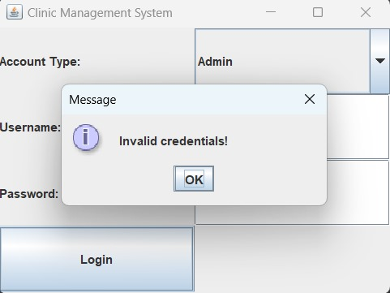
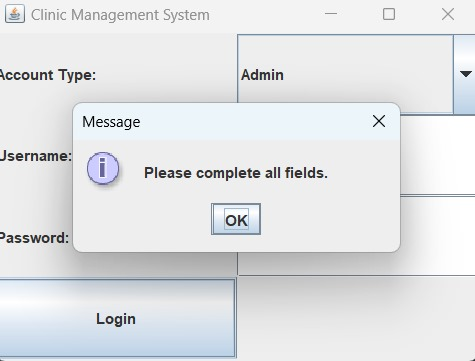

# Time-Healer
Stand-alone application represents a clinic management system 
##GUI 
that class represents the entry point of our application , represtenting the login page , found in <a href=" https://github.com/Menna-Islam/Time-Healer/blob/main/src/com/clinic/GUI.java">
after choosing the role of user there are many cases 
first : entering wrong credentials 

second : leaving on of the fields empty

