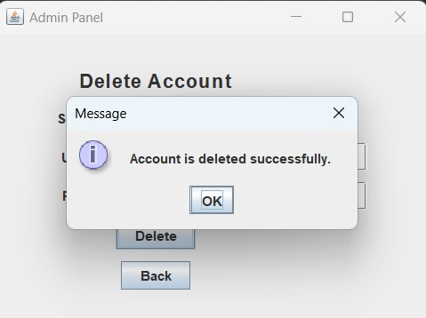
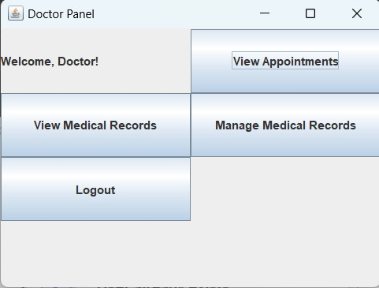

# Time-Healer
Stand-alone application represents a clinic management system 
## GUI 
The entry point of our application is represented by the login page, which is implemented in the  <a href="https://github.com/Menna-Islam/Time-Healer/blob/main/src/GUI.java">GUI.java</a> file.

 Upon selecting the user role, there are three possible scenarios: 
1. entering wrong credentials 

2. leaving on of the fields empty

3. entering valid credentials , navigating us to the page of selected role 

## Admin page 
The administrator page, implemented in the  <a href="https://github.com/Menna-Islam/Time-Healer/blob/main/src/AdminPanel.java">AdminPanel.java</a> file , encompasses all necessary functionalities.

in the admin page 

When clicking the "Manage Database" button, it leads to the following page:

### Add account
Selecting the "Add Account" button

allows the creation of user accounts by specifying the role and entering credentials.
The system handles scenarios for both existing and new users.

Existing User Credentials:

New User Credentials:

and then it goes back to the admin page 

### Edit account
Choosing the "Edit Account" button
first , it requires choosing the role of account to modify and credentials for security 

then,It navigates us to the editing page , requiring to choose what field exactly do you want to modify 

after entering the new data : 

and then it goes back to the admin page 

### Delete account
The "Delete Account" button prompts the selection of the role and entry of credentials for the targeted account.

After deletion:

and then it goes back to the admin page 

## Doctor page 
The doctor page , found in found in <a href="https://github.com/Menna-Islam/Time-Healer/blob/main/src/DoctorPanel.java">DoctorPanel.java</a> file 

provides functionalities for viewing appointments, viewing medical records, and managing medical records.

### View appointments 
Doctors can view and verify all scheduled appointments.

### View medical record 
Doctors can access patient medical records by selecting a specific patient.

### Manage medical record

In addition to viewing records, doctors have the capability to modify medical records.

After modification:
 

## Receptionist page 

The receptionist page, implemented in <a href="https://github.com/Menna-Islam/Time-Healer/blob/main/src/ReceptionistPanel.java">ReceptionistPanel.java</a> file encompasses functionalities for managing patients and scheduling appointments.

### Manage patients 
By clicking the "Manage Patients" button , it navigates us to the page that shows us all patients registered

you have a list of decisions that receptionist can make : 
- add new patient
- create medical record for a patient (has to be existing patient)
- delete patient

#### Adding new patient 
Receptionists can add new patients, filling in necessary details.

Upon completion:

  

and this is the patients sheet after adding the patient

 

#### Creating medical record 

After selecting an existing patient, receptionists can create medical records.
 
 

 

 
### Schedule appointments
Receptionists can view, add, or delete appointments.

 

#### Show and delete appointments 

Receptionists can delete appointments by selecting and confirming the deletion.

 

#### Add appointments 

Receptionists can add appointments and  generating a bill for the booked appointment.

 

Resulting in:

 

