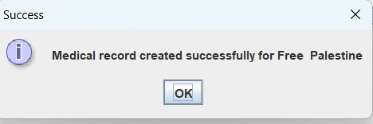

# Time-Healer
Stand-alone application represents a clinic management system 
## GUI 
that class represents the entry point of our application , represtenting the login page , found in <a href="https://github.com/Menna-Islam/Time-Healer/blob/main/src/GUI.java">GUI.java</a> file.

after choosing the role of user there are three cases 
first : entering wrong credentials 

second : leaving on of the fields empty

third : entering valid credentials , navigating us to the page of selected role 

## Admin page 
that class represents administartor page with all the functionalities required , found in  found in <a href=" https://github.com/Menna-Islam/Time-Healer/blob/main/src/com/clinic/AdminPanel.java">AdminPanel.java</a>

in the admin page 

when we press "manage data base button"
It navigates us to this page

### Add account
by choosing "add account" button

you can choose the role of user to create an account for , then enter credentials 

if you enter credentials for an existing user 

if you enter credentials for a new user 

and then it goes back to the admin page 

### Edit account
by choosing "edit account" button
first , it requires choosing the role of account to modify and credentials for security 

then,It navigates us to the editing page , requiring to choose what field exactly do you want to modify 

after entering the new data 

and then it goes back to the admin page 

### Delete account
by choosing "delete account" button
as we frequently said , requirig choosing the role and credentials to the account you want to delete 

then

and then it goes back to the admin page 

## Doctor page 
that class represents doctor page with all the functionalities required , found in  found in <a href=" https://github.com/Menna-Islam/Time-Healer/blob/main/src/com/clinic/DoctorPanel.java">DoctorPanel.java</a>

in doctor page 

### View appointments 
doctor can see and check all the appointments booked 

### View medical record 
doctor also can view medical records of patients 
but first , you have to choose the patient

### Manage medical record

same as viewing record you have to choose role first 
but here , you have the ability to modify medical record

then 

## Receptionist page 

that class represents receptionist page with all the functionalities required , found in  found in <a href=" https://github.com/Menna-Islam/Time-Healer/blob/main/src/com/clinic/ReceptionistPanel.java">ReceptionistPanel.java</a>

in doctor page 

### Manage patients 
by pressing "manage patients" button , it navigates us to the page that shows us all patients registered

you have a list of decisions that receptionist can make : 
- add new patient
- create medical record for a patient (has to be existing patient)
- delete patient

#### Adding new patient 

then 

  

and this is the patients sheet after adding the patient

 

#### Creating medical record 

patient should be extisting to create medical record for them 
 first , we choose patient 
 then , we create medical record 
 
 

 

 
### Schedule appointments
receptionist can see , add or delete appointments

 

#### Show and delete appointments 

receptionist can delete appointment by selecting appointment then delete it 

 

#### Add appointments 

receptionist can add appointment 

 

and then it displays the bill for booked appointment 

 

